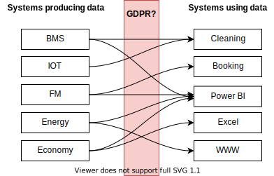
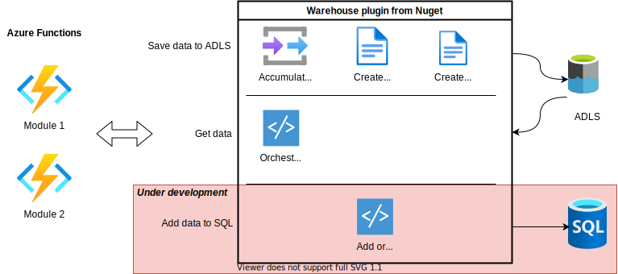

# Building modules

## Why?
There are a lot of interesting data around in Organisations produces knowledge, that other 
Exposing coorporate data can be triggy

## Nuget package: Warehouse 

## What kind of modules you can build
BMS
Economy
EMS
FM

Communication between ADLS and Power BI

Working with dataflows to build many reports

I arbejdet med 
